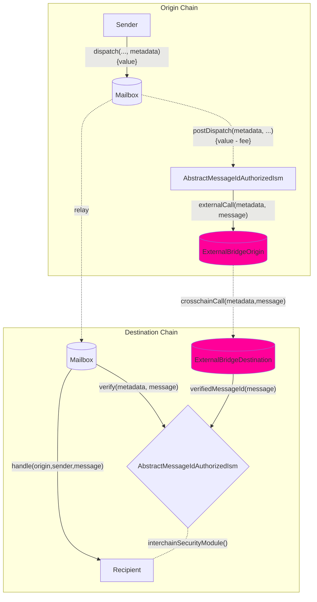

import Tabs from "@theme/Tabs";
import TabItem from "@theme/TabItem";

import { MultiLanguageExample } from "@site/src/components/InteractiveExample";

# 创建你自己的钩子和ISM

钩子和ISM具有互补关系：你可以从源链自定义行为，并在目标链上使用配对的ISM合约来验证你的自定义钩子行为。

你可以根据自己的需求实现和使用自己的钩子和ISM模式。你可以通过在源链上实现`IPostDispatchHook`接口和在目标链上实现`IInterchainSecurityModule`来使用像Wormhole或Chainlink的CCIP这样的外部桥接提供商。

<details>
<summary>`IPostDispatchHook`接口</summary>

<Tabs groupId="lang">
<TabItem value="sol" label="Solidity">

```solidity file=<rootDir>/node_modules/@hyperlane-xyz/core/contracts/interfaces/hooks/IPostDispatchHook.sol#L16-L63

```

</TabItem>

</Tabs>
</details>

<details>
<summary>`IInterchainSecurityModule`接口</summary>

<Tabs groupId="lang">
<TabItem value="sol" label="Solidity">

```solidity file=<rootDir>/node_modules/@hyperlane-xyz/core/contracts/interfaces/IInterchainSecurityModule.sol#L4-L35

```

</TabItem>
</Tabs>
</details>

:::info
钩子目前期望元数据使用[`StandardHookMetadata`库](../reference/libraries/hookmetadata.mdx)进行格式化。
:::

你也可以继承我们的`AbstractMessageIdAuthorizedIsm`，它允许对中间的`verifyMessageId`函数调用进行访问控制，如果从授权的`AbstractMessageIdAuthHook`钩子接收到消息ID，则将其在存储中设置为true。这种模式目前用于[`OpStackHook`](https://github.com/hyperlane-xyz/hyperlane-monorepo/blob/ef2ece300e71a30e8f4f59e5b26e21eea012d43b/solidity/contracts/hooks/OPStackHook.sol#L33C8-L33C8) \<> [`OpStackIsm`](https://github.com/hyperlane-xyz/hyperlane-monorepo/blob/ef2ece300e71a30e8f4f59e5b26e21eea012d43b/solidity/contracts/isms/hook/OPStackIsm.sol#L31)模式。

### 工作流程



### 接口

在实现上述接口后，你可以通过使用我们邮箱中的重载`dispatch`调用来覆盖默认钩子和钩子元数据：

<Tabs groupId="lang">
<TabItem value="sol" label="Solidity">

```solidity file=<rootDir>/node_modules/@hyperlane-xyz/core/contracts/Mailbox.sol#L269-L275

```

### 示例

<MultiLanguageExample
  solidity={({
    mailbox,
    merkleTreeHook,
    originChain,
    destinationDomain,
    destinationChain,
    paddedRecipient,
    body,
  }) => `\
// 从${originChain}发送消息到${destinationChain} TestRecipient
IMailbox mailbox = IMailbox("${mailbox}");
IPostDispatchHook merkleTree = IPostDispatchHook("${merkleTreeHook}");
mailbox.dispatch(
  ${destinationDomain},
  "${paddedRecipient}",
  bytes("${body}"),
  "0x", // 空 元数据
  merkleTree
);
`}
/>

</TabItem>
</Tabs>

- 在源链上，

  - `mailbox.dispatch()`通过`AbstractMessageIdAuthHook.postDispatch()`调用你的自定义钩子。
  - `_postDispatch`检查`latestDispatchedId`是否是从钩子分发的ID，以确保调用钩子的是邮箱合约（因为调用`postDispatch`不受访问控制）
  - `_sendMessageId`调用你的自定义外部桥接逻辑，比如调用CCIP路由器合约。

- 在目标链上，
  - 外部桥接将调用`verifyMessageId`函数（该函数受访问控制）并将`messageId`在`verifiedMessages`映射中设置为true。
  - 在接收到中继器的消息时，邮箱将调用你的ISM合约（在你的接收者地址中指定），该合约检查`verifiedMessages`映射中的messageId是否为true，并相应地向邮箱返回true或false。

:::warning
`AbstractMessageIdAuthorizedIsm`可以通过`postDispatch`调用发送`msg.value`，我们利用`verifiedMessages`的小端序255位来存储`msg.value`，顶部位用于实际接收messageId传递。因此，你可以从源链发送最多2^255数量的原生代币，目标ISM在目标链上只能接收2^255数量的原生代币。
:::

### 访问控制

如果`postDispatch`必须只能用刚刚分发的`message`调用，可以使用邮箱上的`latestDispatchedId`函数来验证消息是否真的被分发了。

:::info
这是用来代替类似`require(mailbox == msg.sender)`的方式，以支持**组合**，其中一个钩子可能将`message`传递给另一个钩子。
:::

<Tabs groupId="lang">
<TabItem value="sol" label="Solidity">

为了方便起见，[`MailboxClient`库](../reference/libraries/mailboxclient.mdx)提供了以下实用工具。

```solidity file=<rootDir>/node_modules/@hyperlane-xyz/core/contracts/client/MailboxClient.sol#L89-L91

```

</TabItem>
</Tabs>
