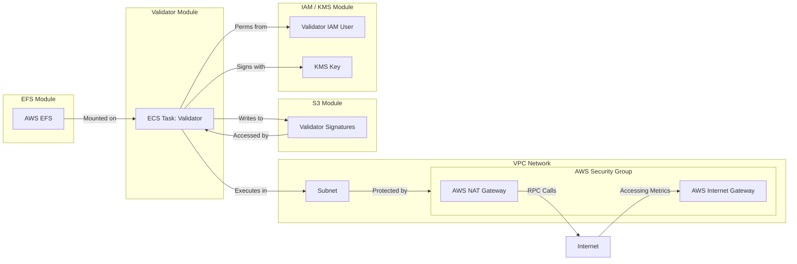
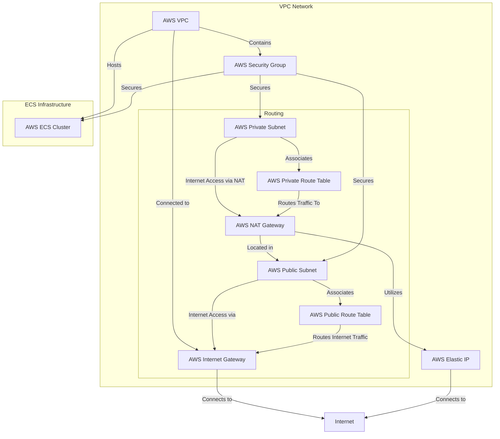

# 使用 Terraform 部署

对于那些更熟悉通过基础设施即代码工具（如 Terraform）在 AWS 上进行部署的用户，我们提供了一个 [**GitHub 示例配置**](https://github.com/hyperlane-xyz/hyperlane-monorepo/tree/main/rust/main/terraform)，旨在设置在 AWS 上运行 Hyperlane 验证者所需的基础设施。它自动创建运行验证者代理所需的资源，如 ECS 集群、VPC、子网和安全组。

:::caution

提供的配置仅作为在核心支持网络上运行验证者的 _示例_。您可能需要修改验证者模块以支持更高级的配置。建议在将此设置用于生产环境之前进行充分测试。

:::

## 概述

提供的 Terraform 包含几个关键部分：

- IAM/KMS 模块：自动为您完成 [代理密钥](set-up-agent-keys.mdx) 的配置。
- S3 模块：自动为您完成 [AWS 签名存储桶](validators/validator-signatures-aws.mdx) 的配置。
- EFS 模块：设置一个可以挂载到验证者的持久卷。
- 验证者模块：使用上述模块运行验证者实例。
- `global.tf`：为验证者可以运行的集群设置顶级网络配置。
- `main.tf`：配置验证者的部署。

下面的图表展示了它们是如何结合在一起的。



## 使用方法

作为先决条件，您需要安装 Terraform 并配置 AWS CLI 以使用您的凭据。

要初始化 Terraform 状态：

```bash
terraform init
```

要生成基础设施更改的计划：

```bash
terraform plan
```

要预览并应用基础设施更改：

```bash
terraform apply
```

要列出输出，例如 KMS、IAM 或 S3 信息，您需要解析 JSON 输出：

```bash
terraform output -json
```

## 模块

存在多个模块，以便您选择希望由 Terraform 管理的验证者设置的部分。

### IAM / KMS

`iam_kms` 模块创建一个 IAM 用户和一个 KMS 密钥，用于安全签名操作。它还设置 IAM 策略和附件，以授予使用 KMS 密钥和其他 AWS 服务（如 S3、EFS 和 ECS）的必要权限。

### S3

`s3` 模块创建一个 S3 存储桶，用于存储与验证者相关的数据，例如签名。它还设置存储桶策略以管理访问和权限，包括公共访问限制和版本控制。

### EFS

`efs` 模块定义一个 EFS 文件系统和访问点，允许验证者应用程序在 EFS 上存储和访问数据。它还设置一个挂载目标，以将 EFS 文件系统连接到网络。

:::note
此模块仅在使用 `validator` 模块时需要。
:::

### 验证者

`validator` 模块使用上述所有模块来集成 EFS、IAM/KMS 和 S3 配置。

此外：
- 创建一个新的 IAM 用户和相关角色以运行验证者。
- 创建一个 S3 存储桶，验证者可以向其写入签名。
- 创建一个 EFS 卷，以在服务中持久化数据。

此模块还：
- 定义一个 ECS 任务定义，用于运行验证者应用程序，包括容器定义、卷配置和日志记录。
- 创建一个 ECS 服务，以管理验证者任务的部署和扩展。

## 主要配置

根级配置设置 VPC、子网、互联网网关、NAT 网关、路由表和安全组以构建网络基础设施。它还提供了 `validator` 模块的示例用法。

```terraform
module "your_validator_name" {
  source = "./modules/validator"

  validator_name    = "your-validator-name"
  origin_chain_name = "originChainName"

  aws_region               = var.aws_region
  validator_cluster_id     = aws_ecs_cluster.validator_cluster.id
  validator_subnet_id      = aws_subnet.validator_subnet.id
  validator_sg_id          = aws_security_group.validator_sg.id
  validator_nat_gateway_id = aws_nat_gateway.validator_nat_gateway.id

  # 禁用验证者任务允许您设置所有所需的基础设施
  # 而不运行实际的验证者。这在第一次设置验证者时非常有用，
  # 这样您可以找到验证者的地址并为其提供资金，然后再
  # 执行公告交易。
  # validator_task_disabled = true
}
```

### 输出

根级 `outputs.tf` 将所有输出从 `main.tf` 中配置的验证者传递出去。**您需要在添加、修改或删除验证者时更新此内容。**

### 示例架构

下面的图表展示了验证者 ECS 集群如何融入顶级网络基础设施。



## 已知问题

### PI 配置

为 PI 链设置自定义配置值并非易事，例如您自己部署的 Hyperlane。当前，您可能需要传递一长串环境变量或命令行参数。

### 单个代理日志

目前，所有代理都记录到同一个日志组 - `DefaultLogGroup`。要将它们分开，您可能需要调整日志组名称并使用新组名称更新代理的日志策略。

### 中继模块

Docker 镜像支持运行两种类型的代理。因此，如果您选择这样做，可以使用验证者模块作为新中继模块的起点。
