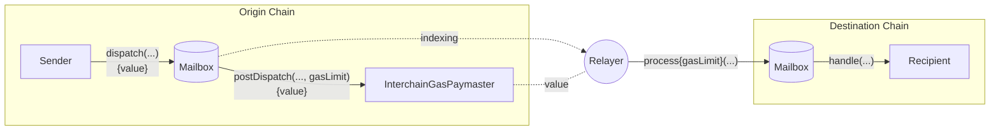

# 概述

Hyperlane 协议将跨链消息传递的传输层与安全层解耦。要运行一个部署，它依赖于观察链上活动的离线代理，这些代理执行协议的传输或安全方面。

1. Hyperlane [验证者](#validator) 是负责安全的轻量级离线代理 - 它们观察源链的 [邮箱](docs/protocol/mailbox.mdx)，并在需要时签署一个默克尔根，以证明邮箱的当前状态。
2. [中继器](#relayer) 满足协议的消息传输要求。它们聚合离线安全元数据以供 [`IInterchainSecurityModule` 接口](/docs/protocol/ISM/modular-security.mdx) 使用，并将消息传递给接收者。

## 验证者 {#validators}

[验证者](docs/protocol/agents/validators.mdx) 满足协议的安全要求，作为 [多签 ISM](docs/protocol/ISM/multisig-ISM.mdx) 或 [Hyperlane AVS](docs/protocol/economic-security/hyperlane-avs.mdx) 的一部分，通过证明 [邮箱](docs/protocol/mailbox.mdx) 消息的有效性，并将其签名提供给中继器。

该签名被存储并公开可用（例如，在 S3 存储桶中），然后由离线中继器和链上跨链安全模块使用。验证者并不是相互联网的，也不需要达成共识；它们也不定期提交链上交易。

这是运营者如果希望帮助保护源链而运行的代理社区，这是帮助去中心化 Hyperlane 消息传递的最重要职责。**请注意，仅仅运行一个验证者并不意味着它在积极贡献于保护消息：** 目的链上的多签 ISM 必须已注册验证者的检查点签名密钥，并且该 ISM 必须被消息接收者使用。

这些代理是用 Rust 实现的，并作为 Docker 镜像和二进制文件分发。

👉 了解更多关于验证者的信息 [这里](docs/protocol/agents/validators.mdx)。

## 中继器 {#relayer}

Hyperlane [中继器](docs/protocol/agents/relayer.mdx) 将跨链消息传递给接收者。

中继是无权限的，只需在链对之间运行一个诚实的中继器即可确保活跃性。运行中继器的要求是：

1. 运营复杂性远高于验证者。
2. 不需要为保护网络而运行。
3. 仅建议用于 Hyperlane 的无权限部署。

Hyperlane 中继器被配置为在一个或多个源链和目的链之间中继消息。
每个 Hyperlane 消息涉及两个交易：

1. 在源链上 [`dispatch`](docs/reference/messaging/send.mdx) 并发送消息。
2. 在目的链上 [`process`](docs/reference/messaging/receive.mdx) 并交付消息。

中继器的工作是将消息交付到目的链。为了履行这一责任：

- 中继器跟踪源链上新消息的到来。
- 它检查接收者指定的 [跨链安全模块 (ISM)](/docs/protocol/ISM/modular-security.mdx)，以收集保护消息所需的元数据。例如，它可能从验证者检查点存储中检索多签 ISM 签名。
- 在组装安全元数据后，中继器将消息发送给目的链上的接收者。

如果消息交付失败（例如，由于缺乏流动性而无法从 Warp Route 合同中转移），中继器将使用指数退避机制重试交付，直到成功为止。

中继器在 Hyperlane 中没有特殊权限。如果中继器密钥被泄露，只有那些密钥持有的代币处于风险之中。

👉 了解更多关于中继器的信息 [这里](docs/protocol/agents/relayer.mdx)。
