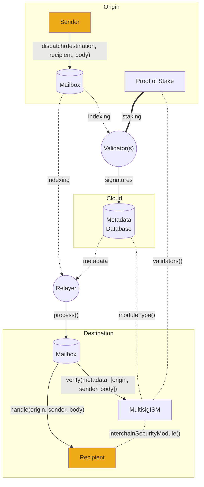

import Tabs from "@theme/Tabs";
import TabItem from "@theme/TabItem";

# 运行验证器

:::tip

- 有关 Hyperlane 中验证器的介绍，请查看 [概述部分](/docs/operate/overview-agents.mdx)。
  :::

按照本指南，您可以在任何现有的 [链](https://github.com/hyperlane-xyz/hyperlane-registry/tree/main/chains) 上运行 Hyperlane 验证器。Hyperlane 验证器是按源链运行的，这些说明是针对单个链编写的。

## 要求

- **安全签名密钥**

  - 验证器使用此密钥签署 `Mailbox` 的最新默克尔根。保护此密钥非常重要。如果它被泄露，攻击者可能会试图伪造消息，导致验证器被削减。
  - Hyperlane 验证器代理当前支持使用通过 API 密钥/秘密访问的 AWS KMS 密钥以及十六进制明文密钥进行签名。有关更多信息，请参见 [代理密钥](../set-up-agent-keys.mdx)。

- **公开可读存储**

  - 验证器将其签名写入链下的公开可访问、高可用性存储，以便可以被 [中继器](../../protocol/agents/relayer.mdx) 聚合。
  - Hyperlane 验证器代理当前支持使用上述相同的 AWS API 密钥将签名存储在 AWS S3 上，以及在本地文件系统中存储签名以进行测试。
  - 该设计是 [开源](https://github.com/hyperlane-xyz/hyperlane-monorepo/tree/56be527d691a11a1ff2de4a390fd0dae8bb77347/typescript/infra/src/agents) 的，并且可以推广到其他存储和密钥解决方案。社区提交的进行中的 [PR for GCS](https://github.com/hyperlane-xyz/hyperlane-monorepo/pull/3156)。

- **机器要求**

  - 验证器可以自己编译 Rust 二进制文件或运行 Abacus Works 提供的 Docker 镜像。可以使用您喜欢的云服务运行该二进制文件。您甚至可以在不同区域运行多个实例以实现高可用性，因为 Hyperlane 没有"双重签名"的概念。
  - 硬件要求和成本很低 - 验证器通常从 2 核心 / 2GB RAM / 4GB 存储的设置开始，典型成本约为 $75/月。

- **RPC 节点**
  - 验证器进行简单的视图调用以从其正在验证的链上的 [Mailbox](../../protocol/mailbox.mdx) 合约中读取默克尔根。您必须使用自己的 RPC URL，而不是任何公共的。
  - 验证器应配置多个 RPC URL 以实现冗余和可靠性。不同链具有不同的配置 - 请查看配置部分以获取详细信息。

:::caution

在 Polygon 主网操作验证器需要访问归档节点。这是因为验证器应仅在根已最终确定后才签名，而 Polygon 需要 256 个区块确认才能实现最终性。

:::

## 指南

### 前提条件

回顾一下 - 在运行生产验证器之前，您需要：

1. 为您的验证器创建一个密钥以进行签名，请参见 [代理密钥](../set-up-agent-keys.mdx) 文档。
1. 设置您的验证器签名要发布的目标，请参见 [AWS 签名存储桶设置](validator-signatures-aws.mdx) 指南。

### 配置

:::tip

经验丰富的操作员可能更喜欢使用 Terraform [部署代理](../deploy-with-terraform.mdx) 或社区提交的 [Ansible 剧本](https://github.com/polkachu/hyperlane) 。此过程将自动创建代理密钥、验证器存储桶、权限以及运行 AWS 上验证器集群所需的任何其他辅助设置。

:::

#### RPC 配置

Hyperlane 验证器和中继器可以使用 **多个 RPC URL** 来提高可靠性和冗余性。设置因链类型而异。

<Tabs groupId="rpc-config">
  
<TabItem value="evm" label="EVM Chains">

EVM 基于链支持配置多个 RPC 端点以实现冗余，并可以指定它们的使用方式。

- **配置多个 RPC：** 使用 [`customRpcUrls`](../config-reference.mdx#chainschain_namecustomrpcurls)。
- **RPC 选择模式 ([`rpcConsensusType`](../config-reference.mdx#chainschain_namerpcconsensustype))**：
  - **回退**：代理尝试第一个 URL，如果需要则切换到下一个。
  - **法定人数**：要求大多数 URL 同意，提交交易的例外情况；如果未指定，它将自动协调"最新"区块以减少同步错误。

</TabItem>

<TabItem value="cosmos" label="Cosmos Chains">

Cosmos 基于链需要 **RPC 和 gRPC 端点** 以确保正常操作。

- **配置多个 RPC：** 使用 [`customRpcUrls`](../config-reference.mdx#chainschain_namecustomrpcurls)。
- **配置 gRPC 端点：** 使用 [`customGrpcUrls`](../config-reference.mdx#chainschain_namecustomgrpcurls)。
- **回退机制：** Cosmos 代理始终使用 **回退模式**。

</TabItem>

<TabItem value="svm" label="SVM Chains">

SVM 基于链支持配置多个 RPC 端点，但 **仅使用单个 RPC**。

- **配置 RPC：** 使用 [`customRpcUrls`](../config-reference.mdx#chainschain_namecustomrpcurls)。

:::caution

对于 **SVM 链**，仅使用 **单个 RPC URL**。没有回退或基于法定人数的选择机制。

:::

</TabItem>

</Tabs>

#### 配置设置

与本地设置一样，在配置验证器时，您应提供一些基本参数。

| 参数                                       | 描述                                                                                             |
| ----------------------------------------------- | ------------------------------------------------------------------------------------------------------- |
| `--db`                                          | 写入持久数据到磁盘的路径。                                                               |
| `--originChainName`                             | 正在验证的链的名称。例如：`ethereum`。                                             |
| `--chains.[originChainName].customRpcUrls`      | 覆盖验证器用于您的源链的默认 RPC URL。                              |
| `--chains.[originChainName].blocks.reorgPeriod` | 验证器在签署 `Mailbox` 默克尔根之前需要等待的区块确认数量。 |

:::info

您的验证器同时接受命令行参数和环境变量作为配置。查看 [代理配置](../agent-config.mdx) 页面和 [配置参考](../config-reference.mdx) 以获取完整的配置可能性列表。

:::

您还可以通过 [`CONFIG_FILES` 环境变量](../config-reference.mdx#config_files) 提供额外配置文件的路径，使用逗号分隔列表。如果您选择在 Docker 中运行，请查看代理配置的 docker 部分以获取将配置文件挂载到 Docker 容器中的提示。

### 特定于设置的配置

这些配置要求因您设置的环境而异。

**检查点签名者配置**

<Tabs groupId="production-setup">
<TabItem value="hex-key" label="Hex Key">

| 参数                                | 描述                                                                                                                                  |
| --------------------------------------- | -------------------------------------------------------------------------------------------------------------------------------------------- |
| `--validator.key`                       | 您验证器的私钥，用于签署默克尔根。                                                                            |
| `--chains.${localChainName}.signer.key` | 您验证器的私钥，将用于在链上提交交易，公开宣布您的验证器的检查点同步器。 |

</TabItem>
<TabItem value="aws-kms" label="AWS KMS">

| 参数             | 描述                                                                                                                            |
| -------------------- | -------------------------------------------------------------------------------------------------------------------------------------- |
| `--validator.region` | 您的 AWS KMS 密钥的区域。例如：`us-east-1`。                                                                              |
| `--validator.type`   | 设置为 `aws` 字面量。                                                                                                              |
| `--validator.id`     | 您验证器的 AWS KMS 密钥的别名，前缀为 `alias/`。例如：`alias/hyperlane-validator-signer-${originChainName}`。 |

</TabItem>
</Tabs>

**交易签名者配置**

在此步骤中配置的密钥需要少量资金以发送初始公告交易。

<Tabs groupId="signer-setup">
<TabItem value="hex-key-evm" label="Hex Key (EVM)">
这与检查点签名者的本地配置相同。

| 参数                                | 描述                                                                                                                                  |
| --------------------------------------- | -------------------------------------------------------------------------------------------------------------------------------------------- |
| `--chains.${localChainName}.signer.key` | 您验证器的私钥，将用于在链上提交交易，公开宣布您的验证器的检查点同步器。 |

</TabItem>
<TabItem value="aws-kms-evm" label="AWS KMS (EVM)">

| 参数                                    | 描述                                                                                                                            |
| ------------------------------------------- | -------------------------------------------------------------------------------------------------------------------------------------- |
| `--chains.${originChainName}.signer.type`   | 设置为 `aws` 字面量。                                                                                                              |
| `--chains.${originChainName}.signer.region` | 您的 AWS KMS 密钥的区域。例如：`us-east-1`。                                                                              |
| `--chains.${originChainName}.signer.id`     | 您验证器的 AWS KMS 密钥的别名，前缀为 `alias/`。例如：`alias/hyperlane-validator-signer-${originChainName}`。 |

</TabItem>
<TabItem value="hex-key-cosmos" label="Hex Key (Cosmos)">

| 参数                                    | 描述                                                                                                                                      |
| ------------------------------------------- | ------------------------------------------------------------------------------------------------------------------------------------------------ |
| `--chains.${originChainName}.signer.type`   | 设置为 `cosmosKey` 字面量。                                                                                                                  |
| `--chains.${originChainName}.signer.prefix` | 设置为与链的地址格式相关联的前缀字面量。例如：`osmo`。                                                           |
| `--chains.${originChainName}.key`           | 您验证器的十六进制私钥，将用于在链上提交交易，公开宣布您的验证器的检查点同步器。 |

</TabItem>
</Tabs>

**检查点同步器配置**

<Tabs groupId="production-setup">
<TabItem value="local-setup" label="Local Setup">

| 参数                  | 描述                                                                                                                                                                                                                                                |
| ------------------------- | ---------------------------------------------------------------------------------------------------------------------------------------------------------------------------------------------------------------------------------------------------------- |
| `--checkpointSyncer.type` | 设置为 `localStorage`。                                                                                                                                                                                                                                     |
| `--checkpointSyncer.path` | 您本地目录的路径，验证器签名将被写入。此值应为本地设置中的 `$MY_VALIDATOR_SIGNATURES_DIRECTORY` 的值。例如：`--checkpointSyncer.path='/tmp/hyperlane-validator-signatures-ethereum'`。 |

:::warning

请注意，中继器 **必须** 配置为 `--allowLocalCheckpointSyncers` 才能读取来自此验证器的签名。

:::

</TabItem>
<TabItem value="production-setup" label="Production Setup (AWS)">

| 参数                    | 描述                                                           |
| --------------------------- | --------------------------------------------------------------------- |
| `--checkpointSyncer.type`   | 设置为 `s3`。                                                          |
| `--checkpointSyncer.bucket` | AWS S3 存储桶名称。                                               |
| `--checkpointSyncer.region` | 您的 AWS S3 存储桶的区域。例如：`us-east-1`。           |
| `--checkpointSyncer.folder` | 用于此验证器的文件夹名称，可以是链的名称 |

</TabItem>
</Tabs>

## 开始验证

### 设置

生产环境的推荐安装方法是使用 Docker 镜像。

<Tabs groupId="docker">
  <TabItem value="docker" label="Docker image">

首先下载 docker 镜像：

```bash
docker pull --platform linux/amd64 gcr.io/abacus-labs-dev/hyperlane-agent:agents-v1.1.0
```

  </TabItem>
  <TabItem value="from-source" label="Building from source">

**克隆和设置**

首先，克隆 Hyperlane 单一代码库：

```sh
git clone git@github.com:hyperlane-xyz/hyperlane-monorepo.git
```

然后按照 `rust` 目录中的 [设置说明](https://github.com/hyperlane-xyz/hyperlane-monorepo/blob/main/rust/README.md) 进行操作。这应该设置 `rustup` 以及如果您在 Apple Silicon 上则设置 Rosetta 2。

```sh
# 安装 rustup
curl --proto '=https' --tlsv1.2 -sSf https://sh.rustup.rs | sh

# (仅限苹果硅) 安装 rosetta 2
softwareupdate --install-rosetta --agree-to-license
```

构建验证器：

```sh
cargo build --release bin validator
```

  </TabItem>
</Tabs>

### 运行二进制文件

对于将签名写入 S3 存储桶并使用 AWS KMS 配置密钥的生产验证器，您必须将 AWS 访问密钥和秘密作为环境变量提供。

| 环境变量    | 描述                                             |
| ----------------------- | ------------------------------------------------------- |
| `AWS_ACCESS_KEY_ID`     | 您验证器的 AWS IAM 用户的访问密钥 ID。     |
| `AWS_SECRET_ACCESS_KEY` | 您验证器的 AWS IAM 用户的秘密访问密钥。 |

有关更多信息，请查看 [代理密钥](../set-up-agent-keys.mdx) 指南。

<Tabs groupId="docker">
  <TabItem value="docker" label="Using Docker">

然后使用相关参数启动容器。例如，您对 AWS 的配置：

```sh
docker run \
  -it \
  -e AWS_ACCESS_KEY_ID=ABCDEFGHIJKLMNOP \
  -e AWS_SECRET_ACCESS_KEY=xX-haha-nice-try-Xx \
  --mount ... \
  gcr.io/abacus-labs-dev/hyperlane-agent:agents-v1.1.0 \
  ./validator \
  --db /hyperlane_db \
  --originChainName <your_chain_name> \
  --reorgPeriod 1 \
  --validator.region us-east-1 \
  --checkpointSyncer.region us-east-1 \
  --validator.type aws \
  --chains.<your_chain_name>.signer.type aws \
  --validator.id alias/hyperlane-validator-signer-<your_chain_name> \
  --chains.<your_chain_name>.signer.id alias/hyperlane-validator-signer-<your_chain_name> \
  --checkpointSyncer.type s3 \
  --checkpointSyncer.bucket hyperlane-validator-signatures-<your_name> \
  --checkpointSyncer.folder <your_chain_name> \
```

  </TabItem>

  <TabItem value="from-source" label="Building from source">
请参阅这些说明以在没有 Docker 的情况下从源构建。

我们可以在 `hyperlane-monorepo/rust` 目录中运行构建的二进制文件：

```sh
# 设置 AWS 环境变量
export AWS_ACCESS_KEY_ID=ABCDEFGHIJKLMNOP
export AWS_SECRET_ACCESS_KEY=xX-haha-nice-try-Xx

# 运行验证器
./target/release/validator \
  --db /hyperlane_db \
  --originChainName <your_chain_name> \
  --reorgPeriod 1 \
  --validator.region us-east-1 \
  --checkpointSyncer.region us-east-1 \
  --validator.type aws \
  --chains.<your_chain_name>.signer.type aws \
  --chains.<your_chain_name>.signer.region<region_name> \
  --validator.id alias/hyperlane-validator-signer-<your_chain_name> \
  --chains.<your_chain_name>.signer.id alias/hyperlane-validator-signer-<your_chain_name> \
  --checkpointSyncer.type s3 \
  --checkpointSyncer.bucket hyperlane-validator-signatures-<your_chain_name>
```

  </TabItem>
</Tabs>

### 宣布您的验证器

[中继器](../relayer/run-relayer.mdx) 需要知道在哪里找到您的验证器的签名。您的验证器将自动尝试通过写入您正在验证的链上的 `ValidatorAnnounce` 合约来宣布自己。

为此，您的验证器必须有少量代币来支付此交易的 Gas 费用。

如果您的验证器尚未宣布自己，并且没有足够的代币支付 Gas 费用，它将记录一条消息，说明需要多少代币。

### 成功！

验证器将索引源 Mailbox 合约以获取消息。如果已发送消息，您应该看到验证器已签署它们的日志消息。如果一切配置正确，您应该会看到 JSON 文件被写入您的 S3 存储桶（如果您遵循了 AWS 设置）或写入您的本地签名目录（如果您遵循了本地设置）。每当向邮箱插入新出站消息时，都会写入新的 JSON 文件。

## 运行多个验证器

我们鼓励大家在尽可能多的链上进行验证。此部分提供了设置多个验证器的考虑因素和说明。

运行多个验证器可以提高安全性和冗余性。通过在不同链或区域部署验证器，您可以减少单点故障的风险。如果一个验证器遇到停机或问题，其他验证器可以继续运行，确保验证过程的完整性和可用性。

### 运行多个验证器：关键考虑因素

- **重用密钥**：同一密钥可以被多个验证器使用。
- **共享 AWS 账户**：同一 AWS 账户可以被多个验证器使用。
- **使用共享 S3 存储桶**：同一检查点同步器 S3 存储桶可以被多个验证器使用，但每个 **必须** 使用不同的文件夹（例如，`--checkpointSyncer.folder validator-1`，`--checkpointSyncer.folder validator-2`）。

### 多个验证器的额外步骤

#### 1. 创建代理配置

- 为每个验证器生成一个代理 [配置](#configuration) 文件，指定它们将验证的链和相应的 RPC URL。
- 确保每个配置文件指向正确的签名密钥和 S3 文件夹。

#### 2. 运行每个验证器

- 确保每个验证器分配一个唯一的数据库路径（例如，`--db /hyperlane_db_validator1`）。
- 配置每个验证器在唯一端口上公开指标（例如，`--metrics-port 9090`，`--metrics-port 9091`）。
- 如果在同一台机器上运行多个验证器，请分配足够的系统资源（CPU、内存和存储）。
- 确保日志被定向到单独的文件或服务，以便于调试和监控。
- 如果使用 Docker，请分配唯一的容器名称和网络配置以避免冲突。

通过遵循这些额外步骤，您可以有效管理多个 Hyperlane 验证器。

## 设计参考


