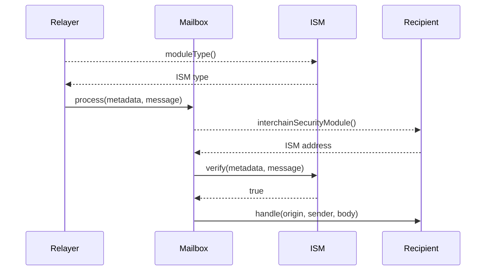

# 序列图

以下展示了一个简化的序列图，描述了跨链消息在目标链上被验证和传递的过程。

:::info

- 如果接收方未实现 `ISpecifiesInterchainSecurityModule` 或 `recipient.interchainSecurityModule()` 返回 `address(0)`，则将使用在 [Mailbox](../mailbox.mdx) 上配置的默认 ISM 来验证消息。
- 为了清晰起见，这一点在序列图中被省略。

:::

