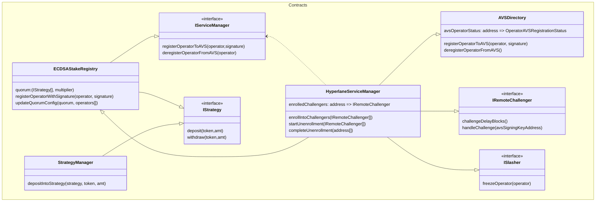
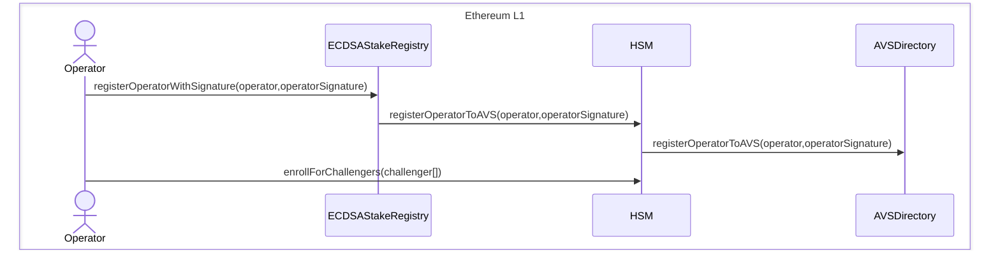
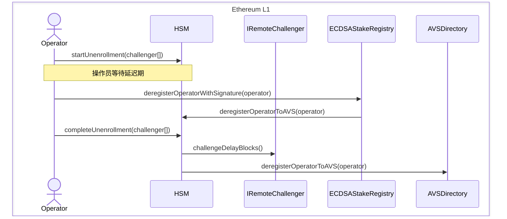
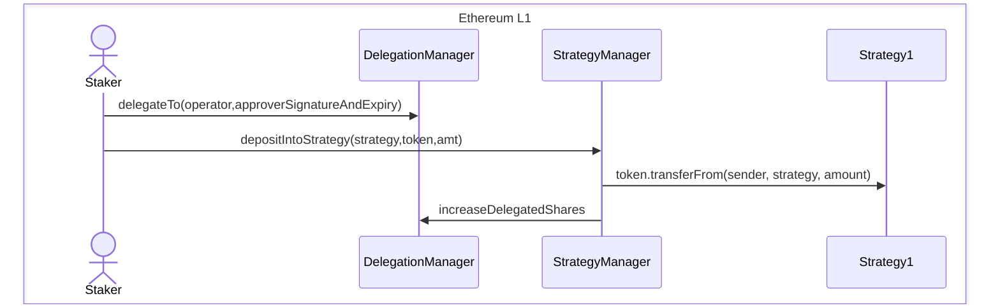
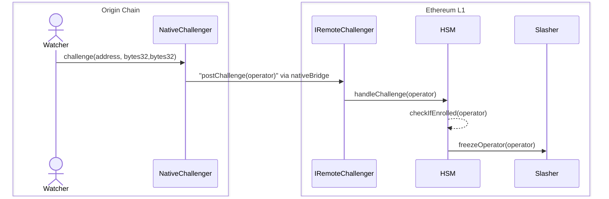

import Tabs from "@theme/Tabs";
import TabItem from "@theme/TabItem";

# Hyperlane AVS

### 概述

欢迎来到 Hyperlane AVS 文档。本指南将帮助您了解 Hyperlane 的 AVS（主动验证服务）模块，该模块建立在 EigenLayer 之上，这是以太坊的重质押协议。

Hyperlane 目前采用权威证明模型来确保安全性，其中选择了一组受信任的验证者来维护 [安全性](/docs/protocol/ISM/multisig-ISM.mdx)。然而，如果任何验证者错误签名或出于恶意意图签名，则没有任何后果，因为这些验证者没有经济利益。这正是 AVS 模块旨在解决的缺口。

```mermaid
flowchart TB
    subgraph Ethereum
      Staker
      Operator
      EL[EigenLayer]
      H_AVS[Hyperlane AVS]
      CH1[Challenger1]
      CH2[Challenger2]
      CH3[Challenger3]

      Operator -- "(de)register()" --> H_AVS
      Staker -- "deposit(operator)" --> EL

      H_AVS <-..-> EL
      CH1 -. "handleChallenge(operator)" .-> H_AVS
      CH2 -. "handleChallenge(operator)" .-> H_AVS
      CH3 -. "handleChallenge(operator)" .-> H_AVS

      style H_AVS fill: #FF0099
      style EL fill: #1a0c6d
      style CH1 fill: #006400
      style CH2 fill: #006400
      style CH3 fill: #006400
    end
```



AVS 模块独特地实现了 Hyperlane 协议中的 [经济安全](/docs/protocol/economic-security/economic-security.mdx)，以最低的成本为其支持的每个链引导新的验证者网络。这是通过利用可以保护来自和在滚动链之间的出站消息的共享质押池来实现的。这个过程中的主要利益相关者包括：

- **操作员** - 选择加入 Hyperlane AVS 服务并开始验证指定链的出站消息的 EigenLayer 操作员
- **质押者** - 将其质押委托给操作员以保护网络的 EigenLayer 质押者
- **应用程序** - 利用 Hyperlane 的应用程序，寻求在链之间经济性地保护其消息

:::caution

目前 EigenLayer 尚未启用惩罚和奖励支付。除了 AVS 之外，签名和验证必须在 [跨链安全模块 (ISM)](/docs/protocol/ISM/modular-security.mdx) 中设置。

:::

### 架构



上述类图描述了当前 AVS 模块合约的架构。至关重要的是，它描述了我们通过 `IRemoteChallenger` 接口支持的 _"metaAVS"_ 设计模式。

### `IRemoteChallenger`

Hyperlane 的操作员可以灵活地在其选择的链上操作，使 AVS 模块适应任何链或挑战者。然而，这种灵活性可能导致缺乏一个普遍接受的"权威"真相来源，以便在主网进行惩罚。这是因为欺诈只能在原链上得到证明，因此需要一种方法将该信息传递到质押所在的链上。

秉持无权限互操作性的理念，我们相信应用程序开发者应该有能力定义自己的真相来源，并为其应用程序的经济安全建立保障。这包括能够编程挑战条件和惩罚窗口。

为了实现这种级别的自定义，我们引入了 `IRemoteChallenger` 接口。只有在 `ism.verify()` 在检测到欺诈签名的链上成功执行后，`handleChallenge` 函数才会被调用。如上所述，为这个基础 ISM 设置强有力的安全措施至关重要。

```solidity
interface IRemoteChallenger {
    /// @notice 返回处理挑战之前必须挖掘的区块数量
    /// @return 返回处理挑战之前必须挖掘的区块数量
    function challengeDelayBlocks() external view returns (uint256);

    /// @notice 处理操作员的挑战
    /// @param operator 操作员的地址
    function handleChallenge(address operator) external;
}
```

此配置应为不可变且可供任何 AVS 操作员查看和选择加入。`handleChallenge` 函数明确编码了您期望从源链（例如 Arbitrum）传递到以太坊主网的挑战的方式，其中 AVS 合约和 `IRemoteChallenger` 存在。

对于 Arbitrum，可以是滚动链的本地桥，而对于另一个 L1，可以是基于委员会的解决方案。我们的接口是挑战者实现无关的，以便在此设计领域提供灵活性。这使我们能够通过在 L1 上成功调用 `ism.verify()` 后调用 `handleChallenge()` 来重用现有的 hook-ISM 设置。合理的 `challengeDelayBlocks` 应该略长于一周，以便使用滚动链的本地桥。

作为操作员，您需要审查不同的 `IRemoteChallenger` 合约，并评估其风险和回报。如果感兴趣，您可以直接从 `HyperlaneServiceManager` 合约中注册一个或多个挑战者。

:::note

IRemoteChallenger 实现尚未在生产中上线。

:::

### 注册工作流程

前提条件：操作员必须作为 EigenLayer 操作员注册（通过其 CLI）



操作员需要注册特定的挑战者，以便在无权限惩罚的情况下实现经济安全。作为操作员，您可以检查每个远程挑战者，并根据风险选择您希望加入的挑战者。这也意味着没有集中权限或白名单，这将成为为不同滚动链堆栈添加挑战者的瓶颈。操作员在解除注册延迟区块通过后，可以选择解除注册。

### 解除注册工作流程



操作员只能在解除注册所有已注册的挑战者后解除注册，每个挑战者都可以有自己的延迟期。这是为了确保操作员在任何挑战者的挑战期结束之前无法撤回其质押。

### 质押工作流程



在 EigenLayer 的设计中，质押者的资金是安全的，因为在惩罚激活之前，它们不会被 AVS 访问。这确保了没有资金在未提前风险的情况下处于风险之中。此外，该设计不允许用户单独选择加入 Hyperlane AVS，因为质押是通过 StrategyManager 管理并指向特定操作员的。

### 惩罚工作流程



惩罚机制旨在实现无权限和灵活性。`IRemoteChallenger` 接口允许不同的惩罚机制实现。例如，原链上的本地挑战者调用 `postChallenge` 函数，然后调用 `HyperlaneServiceManager` 合约上的 `handleChallenge` 函数。`HyperlaneServiceManager` 合约随后检查操作员是否已注册到挑战者，并调用 `Slasher` 合约上的 `freezeOperator` 函数以冻结操作员的质押。

:::note

挑战者和惩罚者合约尚未在生产中上线。该序列图可能会根据最终实现而变化。

:::

### 合约部署

<Tabs>
  <TabItem value="ethereum" label="Ethereum" default>  
| 名称                                                                                                                                                                              | 代理                                                                                                                           | 实现                                                                                                                  |
| --------------------------------------------------------------------------------------------------------------------------------------------------------------------------------- | ------------------------------------------------------------------------------------------------------------------------------- | ------------------------------------------------------------------------------------------------------------------------------- |
| [`ECDSAStakeRegistry`](https://github.com/hyperlane-xyz/hyperlane-monorepo/blob/f0df1a4cd1a9a6ec2e01b106941a2d4e42e5ba18/solidity/contracts/avs/ECDSAStakeRegistry.sol)           | [`0x272CF0BB70D3B4f79414E0823B426d2EaFd48910`](https://etherscan.io/address/0x272CF0BB70D3B4f79414E0823B426d2EaFd48910) | [`0xa11b1a385287b5167ecca6a38f63abeab981d589`](https://etherscan.io/address/0xa11b1a385287b5167ecca6a38f63abeab981d589) |
| [`HyperlaneServiceManager`](https://github.com/hyperlane-xyz/hyperlane-monorepo/blob/f0df1a4cd1a9a6ec2e01b106941a2d4e42e5ba18/solidity/contracts/avs/HyperlaneServiceManager.sol) | [`0xe8E59c6C8B56F2c178f63BCFC4ce5e5e2359c8fc`](https://etherscan.io/address/0xe8E59c6C8B56F2c178f63BCFC4ce5e5e2359c8fc) | [`0x3127e69517ec2268dd5745c97194d387a4fc0c45`](https://etherscan.io/address/0x3127e69517ec2268dd5745c97194d387a4fc0c45) |
  </TabItem>
  <TabItem value="holesky" label="Holesky">
    | 名称                                                                                                                                                                              | 代理                                                                                                                           | 实现                                                                                                                  |
| --------------------------------------------------------------------------------------------------------------------------------------------------------------------------------- | ------------------------------------------------------------------------------------------------------------------------------- | ------------------------------------------------------------------------------------------------------------------------------- |
| [`ECDSAStakeRegistry`](https://github.com/hyperlane-xyz/hyperlane-monorepo/blob/f0df1a4cd1a9a6ec2e01b106941a2d4e42e5ba18/solidity/contracts/avs/ECDSAStakeRegistry.sol)           | [`0xFfa913705484C9BAea32Ffe9945BeA099A1DFF72`](https://holesky.etherscan.io/address/0xFfa913705484C9BAea32Ffe9945BeA099A1DFF72) | [`0x628bc518ed1e0e8c6cbcd574eba0ee29e7f6943e`](https://holesky.etherscan.io/address/0x628bc518ed1e0e8c6cbcd574eba0ee29e7f6943e) |
| [`HyperlaneServiceManager`](https://github.com/hyperlane-xyz/hyperlane-monorepo/blob/f0df1a4cd1a9a6ec2e01b106941a2d4e42e5ba18/solidity/contracts/avs/HyperlaneServiceManager.sol) | [`0xc76E477437065093D353b7d56c81ff54D167B0Ab`](https://holesky.etherscan.io/address/0xc76E477437065093D353b7d56c81ff54D167B0Ab) | [`0xa3ab7e6ce24e6293bd5320a53329ef2f4de73fca`](https://holesky.etherscan.io/address/0xa3ab7e6ce24e6293bd5320a53329ef2f4de73fca) |
  </TabItem>
</Tabs>
