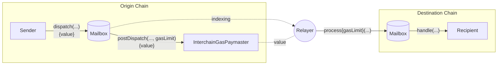
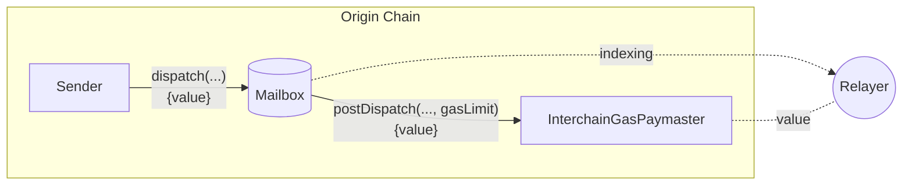
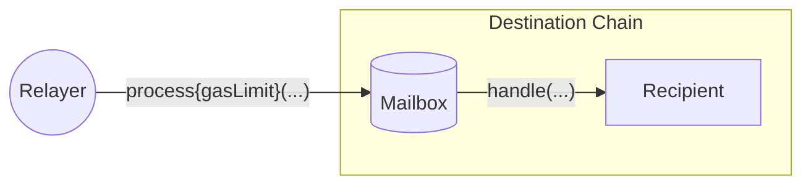

# 跨链燃气支付

成功的跨链消息需要两笔交易；一笔在源链上发送消息，另一笔在目标链上交付消息。

为了方便，Hyperlane 在源链上提供了一个链上接口，允许消息发送者向 [中继器](./agents/relayer.mdx) 支付 [费用](#interchain-gas-payment-calculation)，以便在目标链上交付消息。这种支付被称为 **跨链燃气支付**。

## 跨链燃气支付流程

要 [交付消息](../reference/messaging/receive.mdx)，必须在目标链上包含一笔交易，该交易调用邮箱的 `process` 函数，并带有编码的消息和 ISM 元数据。

为了方便，一个 [中继器](../operate/relayer/run-relayer.mdx) 监视已调度的消息，并在收到足够的支付后，代表消息发送者提交处理交易。这就是 _跨链燃气支付_。

由于消息可以触发任意代码执行，中继器必须在消息调度时使用 `gasLimit` 来计量 [`handle` 调用](../reference/messaging/receive.mdx#handle)，以便适当地收费。

## 跨链燃气支付者

跨链燃气支付由 `跨链燃气支付者` (IGP) 智能合约促进。

这些合约公开了 [跨链燃气支付者接口](../reference/hooks/interchain-gas.mdx)，允许消息发送者使用源链上的原生代币支付 [中继器](./agents/relayer.mdx)，以覆盖在目标链上交付消息的费用。

每个 `跨链燃气支付者` 合约对应于一个中继器。您可以在 [地址](../reference/contract-addresses.mdx) 中找到 Abacus Works 的中继器地址。

### 跨链燃气支付计算

跨链燃气支付的计算如下：

$$
destinationTxCost = destinationGasPrice * gasLimit
\\[5pt]
exchangeRate = \frac{originGasTokenPrice}{destinationGasTokenPrice}
\\[5pt]
originFee = exchangeRate * destinationTxCost
$$

`gasLimit` 和 `exchangeRate` 分别由消息发送者和中继器配置。

## 信任假设

跨链燃气支付基于消息发送者和中继器之间的社会契约。换句话说，中继器可以在未交付相应消息的情况下接收跨链燃气支付。因此，在进行跨链燃气支付时，建议使用与已知和信誉良好的中继器相关联的 IGP 合约。

诚实的中继器实现将尊重对其 IGP 的任何成功燃气支付，无论实际支付了多少代币。通过保持 [燃气预言机](../reference/hooks/interchain-gas.mdx) 的最新状态，中继器可以确保燃气支付仅在支付了"公平"价格的情况下成功。

在 Hyperlane 协议中，对中继器没有信任假设，在任何情况下，恶意中继器都无法审查或伪造消息。中继器能做的最糟糕的事情就是接受支付而不交付消息。

## 了解更多

- 有关燃气限制计算、基准建议、燃气预言机和目标燃气配置的详细信息，请参阅 [跨链燃气支付详情](../reference/hooks/interchain-gas.mdx)。
- 有关中继器设置和实施指导，请参见 [中继器](./agents/relayer.mdx) 部分。
