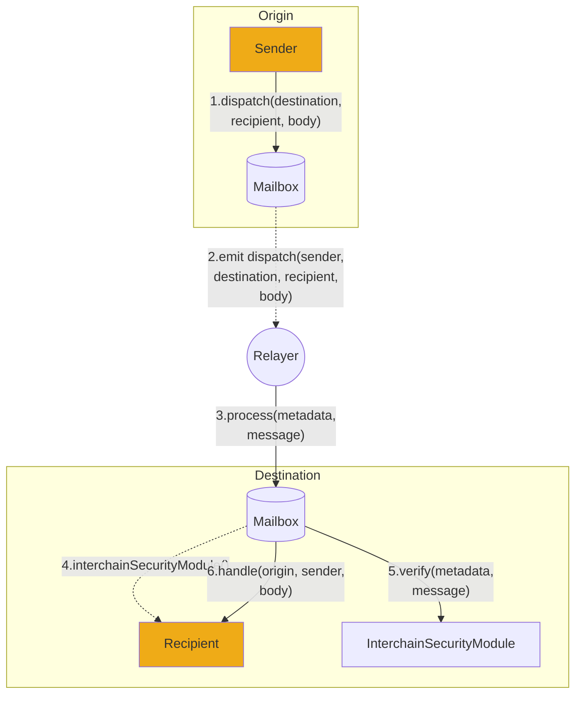

# 协议概述

Hyperlane 是第一个 [无权限的互操作性](../deploy-hyperlane.mdx) 层，允许智能合约开发者在区块链之间发送任意数据。

开发者可以使用 Hyperlane 移动代币、执行函数调用，以及其他许多功能，从而创建跨链应用程序，这些应用程序可以被任何区块链上的用户访问。

用户通过 [邮箱](./mailbox.mdx) 智能合约与 Hyperlane 协议进行交互，这些合约提供了一个链上消息接口，用于发送和接收跨链消息。

Hyperlane 采取模块化的安全性方法，允许应用程序配置并选择一系列 [跨链安全模块](../protocol/ISM/modular-security.mdx) (ISM)。应用程序可以指定一个 ISM，以自定义保护其与 Hyperlane 消息接口集成的安全模型。

