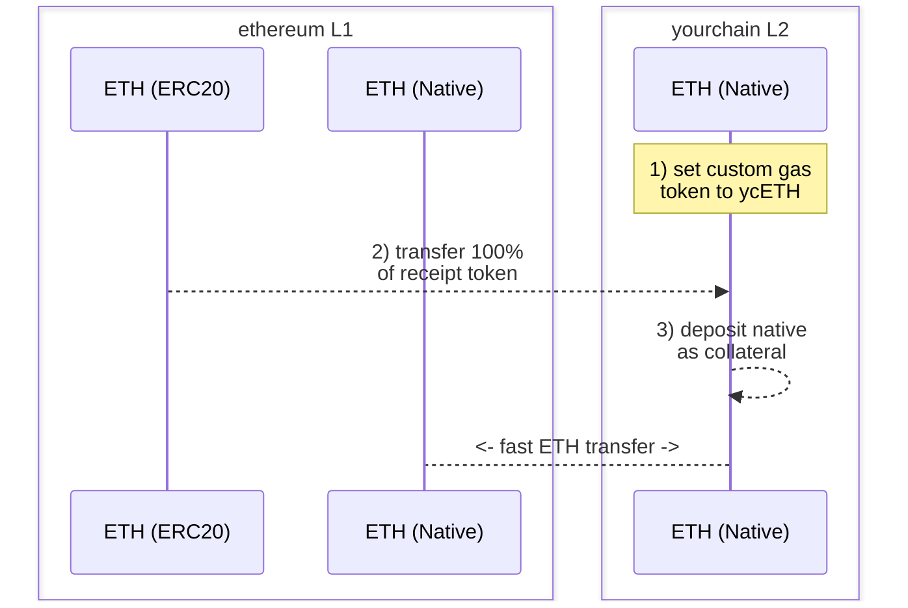

# Warp Routes: 通过自定义燃气代币实现快速本地转账

本文将指导您如何使用 Hyperlane 启用通过自定义燃气代币进行快速本地转账到您的 L2 网络。

## 主要动机

1. 创建一个自定义燃气代币，以便在您选择的 L2 上使用。
2. 使用该燃气代币实现快速本地转账，而不是通过规范桥接进行长时间的结算等待。

## 前提条件

要完成以下操作指南，您需要具备以下条件：

1. 一个 L2 网络（"yourchain"），您可以在其上指定一个 [自定义燃气代币](https://docs.arbitrum.io/launch-orbit-chain/how-tos/use-a-custom-gas-token)，并希望启用快速本地转账。
2. 一个唯一的部署者或授权所有者，以接收收据代币的铸造（有关该代币的更多信息见下文）。
3. 安装了 [Hyperlane CLI](https://docs.hyperlane.xyz/docs/reference/cli) 的实例，并且有一个作为 `HYP_KEY` 的钱包私钥，已在所有相关网络上获得资金。

## 操作指南：快速本地转账

:::info

- 请注意，下面提到的"收据代币"是一个（一次性）可铸造的"虚拟"代币，用于抵押您链上对应 L1 的传输路线。创建后，您将销毁该代币的铸造权。
- 此外，根据您的 L2，您自定义燃气代币的代币符号可能与您的收据代币相同。如果在以太坊上部署，您可能希望将符号设置为 `ETH`。

:::

### 1) 部署收据代币

在以太坊上部署一个 `ETH` 收据代币，以成为您 L2 的自定义燃气代币。

1. 例如，您可以通过 [Remix](https://remix.ethereum.org/) 使用一个有资金的钱包和类似下面的合约来部署您的收据代币：

   ```solidity
   // SPDX-License-Identifier: MIT
   pragma solidity ^0.8.20;

   import "@openzeppelin/contracts/token/ERC20/ERC20.sol";

   contract YourchainETH is ERC20 {
       constructor() ERC20("YourchainETH", "ETH") {
           _mint(msg.sender, 10000000 * (10 ** 18));
       }
   }
   ```

2. 确保您 `ETH` 收据代币的总供应量 100% 铸造给部署者或授权地址。这必须是一次性铸造事件，以避免以太坊 ↔ yourchain 本地传输路线的价值稀释。
3. 部署后，保存合约地址以供后续使用。

### 2) 设置自定义 Gas Token

将 yourchain 的自定义燃气代币设置为新部署的 `ETH` ERC20 收据代币。

1. 使用 OP 堆栈设置自定义燃气代币： https://docs.optimism.io/builders/chain-operators/features/custom-gas-token
2. 使用 Arbitrum Orbit 设置自定义燃气代币： https://docs.arbitrum.io/launch-orbit-chain/how-tos/use-a-custom-gas-token

### 3) 转移所有收据代币

使用您 L2 的规范桥将 100% 的 `ETH` 收据代币从以太坊转移到 yourchain。

1. 使用 OP 堆栈标准桥进行转移： https://docs.optimism.io/builders/app-developers/bridging/standard-bridge
2. 使用 Arbitrum Orbit 桥进行转移： https://docs.arbitrum.io/launch-orbit-chain/how-tos/add-orbit-chain-to-bridge-ui

### 4) 部署本地传输路线

使用 Hyperlane CLI，部署以太坊 `ETH` EvmHypNative ↔ yourchain `ETH` EvmHypNative 传输路线：

1. 运行 `hyperlane warp init` 并完成以下流程：
   1. 使用空格选择 `ethereum` 和 `yourchain`，然后按回车。
   2. 对于以太坊，选择 `native` 并接受邮箱。
   3. 对于 yourchain，选择 `native` 并接受邮箱。
2. 在执行部署之前，确保 yourchain 的 `metadata.yaml` 中定义了 `blockExplorers` 字段。这将用于合约验证，以便轻松抵押 yourchain 的传输路线。
3. 运行 `hyperlane warp deploy` 并确认传输部署配置符合预期。
4. 执行后，您的 `yourchain-ethereum-config.yaml` 部署文件将类似于以下内容：

   ```solidity
   # yaml-language-server: $schema=../schema.json
   tokens:
     - addressOrDenom: "0x3e5bB1a03fef5DB15A320885E6A0C8Bff8b656bd"
       chainName: yourchain
       connections:
         - token: ethereum|ethereum|0x6d64832bDB4F04721D4F23CCbF17326cb636101e
       decimals: 18
       name: Ether
       standard: EvmHypNative
       symbol: ETH
     - addressOrDenom: "0x6d64832bDB4F04721D4F23CCbF17326cb636101e"
       chainName: ethereum
       connections:
         - token: ethereum|yourchain|0x3e5bB1a03fef5DB15A320885E6A0C8Bff8b656bd
       decimals: 18
       name: Ether
       standard: EvmHypNative
       symbol: ETH

   ```

### 5) 抵押您的传输路线

通过 `receive()` 函数将 yourchain 的 `ETH` 作为抵押存入 yourchain 的本地传输路线。如果需要，您可以通过扫描仪的 UI 或像 Metamask 这样的钱包使用已验证的合约来完成此操作。

这将抵押本地传输路线，使用户能够快速桥接他们的本地资产到 yourchain 和从 yourchain。

### 6) 测试

您可以使用以下命令发起一次单个 wei 的测试转账：

```bash
hyperlane warp send --relay --symbol ETH
```

`--relay` 标志是可选的，将消息 中继 到目标链。

您还可以在后台运行一个仅为您的传输路线提供服务的中继器：

```bash
hyperlane relayer --symbol TOKEN
```

您可以在设置了传输路线的任一方向进行测试。

:::info
默认情况下，您的传输核心配置位于本地注册表 `$HOME/.hyperlane/deployments/warp_routes` 中，可与 `--warp` 标志一起使用。
:::

:::success
🎉 恭喜！您现在已通过自定义燃气代币在您的 L2 上启用快速本地转账。
:::



:::warning
请注意，此抵押策略承担某些 ISM 信任假设。
:::

## 资源

请查看 [inEVM 桥](https://bridge.inevm.com/) 以查看这些传输路线的实际示例。

查看 Hyperlane 支持团队和 Injective 发布的一些额外信息：

- [inEVM 聚焦：Hyperlane](https://blog.injective.com/en/inevm-spotlight-hyperlane-2/)
- [连接 Injective：Hyperlane 开启 inEVM 桥](https://medium.com/hyperlane/connecting-injective-hyperlane-opens-the-inevm-bridge-6f1d3edf0ff8)
- [Hyperlane 和 Injective | 扩展机会](https://medium.com/@kobriyyu/hyperlane-and-injective-expanding-opportunities-8ce170b72da7)
