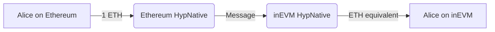
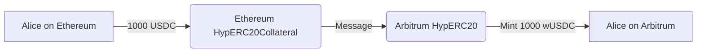

# Warp Routes: 示例用法

Warp Routes 定义了资产在链之间的移动方式，无论是作为原生代币、合成表示，还是抵押支持的资产。选择路线取决于资产类型和在目标链上的期望行为。

## Warp Route 组合

### 1. 原生到原生

此路线允许在两个都使用自己原生代币的链之间转移原生代币。

:::info
此类型的路线仅应在两个网络具有等值的原生代币时使用，例如 inEVM 和以太坊。
:::

#### 设置

- **HypNative** 合约已在两个链上部署。

#### 示例流程

```
Transaction Type: Native to Native Transfer
From: Ethereum (ETH)
To: inEVM (ETH)
Amount: 1 ETH
```

#### 图示



#### 用例

- Alice 想要快速将价值从以太坊转移到 inEVM。

### 2. 原生到合成

此路线在另一条链上创建原生代币的合成表示。

#### 设置

- **HypNative** 合约已在原链上部署，原链上存在原生资产。
- **HypERC20** 合约已在目标链上部署，合成代币在此铸造。

#### 示例流程

```
Transaction Type: Minting Synthetic Token from Native Token
From: Celo (CELO)
To: Optimism (wCELO)
Amount: 100 CELO
```

#### 图示


#### 用例

- 一个基于 Celo 的项目希望在 Optimism 上使用他们的原生 CELO 代币。

### 3. 抵押到合成

此路线允许基于抵押的 ERC20 代币创建合成代币。

#### 设置

- **抵押合约 (HypERC20Collateral)** 已在源链上部署，原始资产存在于此。
- **合成合约 (HypERC20)** 已在目标链上部署，资产在此铸造。

#### 示例流程

```
Transaction Type: Minting Synthetic Token from Collateral Token
From: Ethereum (USDC - Original Asset) - Collateral Source
To: Arbitrum (wUSDC - Minted Synthetic Asset) - Synthetic Destination
Amount: 1000 USDC
```

#### 图示



#### 用例

- Alice 希望在 Arbitrum 上使用她的 USDC，而无需将实际的 USDC 移动到 Arbitrum 或依赖 Arbitrum 的桥接 USDC。
