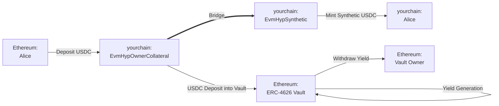
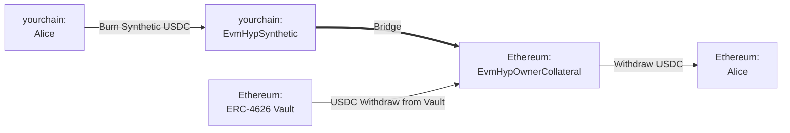

# 部署收益路由

本指南的目标是说明如何使用 Hyperlane 的传输路线创建收益生成桥梁，确保闲置的桥接资产通过时间复利产生收益。根据不同的变体（详细信息见下文），收益将分配给收益路由的拥有者或用户。

## 前提条件

要完成以下操作指南，您需要具备以下条件：

1. 一个您选择的起始网络和目标网络，您希望在这两个网络之间部署收益路由。
2. 在起始网络上，您希望生成收益的 [ERC-4626 保险库](https://ethereum.org/en/developers/docs/standards/tokens/erc-4626/) 地址。该保险库的基础资产将被设置为传输路线的抵押品（例如，如果保险库是 USDC 资金，则传输路线也将支持 USDC 转移）。
3. 安装了 [Hyperlane CLI](https://docs.hyperlane.xyz/docs/reference/cli) 的实例，并将钱包私钥设置为 `HYP_KEY` 环境变量，该私钥在您的起始和目标网络上有资金。

## 操作指南

### 概念

- **ERC-4626 保险库**：以太坊标准的代币化收益保险库。存入时，会铸造代表基础资产所有权的股份代币。
- **收益路由 (EvmHypOwnerCollateral & EvmHypSynthetic)**：Hyperlane 表示收益型 EVM 抵押代币的方式。请注意，收益路由的保险库中存入的资产地址被用作传输路线的抵押代币。
  - 该特定收益路由变体将保险库的收益分配给 **拥有者**。还有一种替代设置是将收益分配给用户（EvmHypCollateral & EvmHypSyntheticRebase）。在本指南的大部分内容中，我们将引用前者的变体。概念保持不变。

:::info
为了本操作指南的方便，"起始"网络将指生成收益的网络（例如，以太坊有一个可以领取收益的 USDC 借贷保险库。在目标链上铸造的合成 USDC 被称为 yourchain）。
:::

以下是以太坊与 yourchain 之间的桥接流程

**桥接 USDC：以太坊 → yourchain**

在这个例子中，Alice 希望在以太坊和 yourchain 之间桥接 USDC。收益路由将把她的 USDC 转移到一个收益型 ERC-4626 保险库，然后在 yourchain 上铸造她的合成 USDC。请注意，收益路由的拥有者可以领取从该保险库生成的收益。

**桥接 USDC：yourchain → 以太坊**

当Alice 想要返回以太坊时，反向操作会发生。收益路由将销毁她的合成 USDC，从以太坊的保险库中提取 USDC，并将其返回给她。

### 收益路由部署步骤

使用 Hyperlane CLI，在以太坊和 yourchain 上分别部署 USDC EvmHypOwnerCollateral 和 EvmHypSynthetic 代币：

#### 1. 运行 `hyperlane warp init` 生成传输路线配置：

1. 选择 `yourchain` 和 `Ethereum`，使用空格选择，然后按回车。
2. 对于以太坊，选择 `collateralVault`，接受邮箱，并输入 yourchain 上的 USDC 保险库地址。
    - 或者，您可以选择 `collateralVaultRebase`，这是一个通过增加持有量来分配收益给用户的收益路由变体。
3. 对于 yourchain，选择 `synthetic` 并接受邮箱。

    - 如果您选择了 `collateralVaultRebase`，则必须与 `syntheticRebase` 配对。

#### 2. 运行 `hyperlane warp deploy` 部署传输路线。

### 领取收益

根据收益路由的变体，可以通过调用 `HypERC4626OwnerCollateral.sweep()` 或 `HypERC4626Collateral.rebase()` 在各自的合约上领取收益。

:::success
🎉 恭喜！您现在已经创建了一个新的收益路由与您的保险库。桥接的用户资产现在可以在起始传输路线中赚取被动收益。
:::

:::warning
请注意，这种抵押策略承担某些 ISM 信任假设，并且存在基础 [ERC-4626 保险库](https://ethereum.org/en/developers/docs/standards/tokens/erc-4626/) 变得不足抵押的固有风险。
:::

## 资源

有关这些步骤的更深入细节，请参阅 [桥接代币](/docs/guides/deploy-warp-route) 指南。

查看一些由 Hyperlane 支持团队、Cheese Chain 和以太坊基金会发布的额外信息：

- [Hyperlane：介绍收益路由](https://medium.com/hyperlane/introducing-yield-routes-f7e8fd091443)
- [ERC-4626 代币化保险库标准](https://ethereum.org/en/developers/docs/standards/tokens/erc-4626/)
