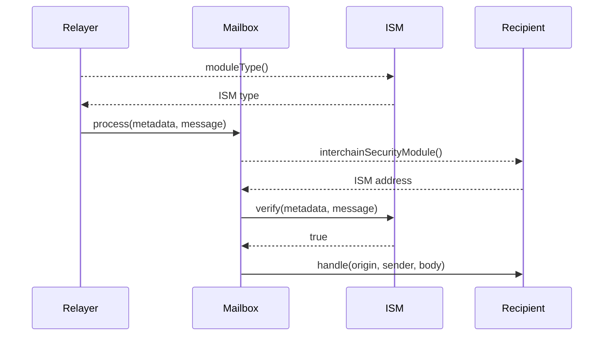

import Tabs from '@theme/Tabs';
import TabItem from '@theme/TabItem';

import IsmDiagram from '@site/src/diagrams/messaging-isms.md';

# 跨链安全模块接口

Hyperlane 通过通用的智能合约接口模块化跨链消息安全。实现负责验证在目标链上传递的消息确实是在源链上发送的，这需要使用某些证明元数据。

<IsmDiagram/>

消息接收者可以通过指定 `InterchainSecurityModule` 地址来设置自定义的安全约束。这个实现可以根据应用程序的需求进行配置、组合和定制。

<details>
<summary>`IInterchainSecurityModule` 接口</summary>

<Tabs groupId="lang">
<TabItem value="sol" label="Solidity">

```solidity file=<rootDir>/node_modules/@hyperlane-xyz/core/contracts/interfaces/IInterchainSecurityModule.sol
```

</TabItem>
</Tabs>
</details>

## 验证

```solidity file=<rootDir>/node_modules/@hyperlane-xyz/core/contracts/interfaces/IInterchainSecurityModule.sol#L31-L34
```

Mailbox 在向接收者传递消息之前会调用 `verify`。如果 `verify` 回滚或返回 `false`，消息将不会被传递。

- `_metadata` 由中继器提供的任意字节组成。通常，这些字节是特定于 ISM 的。例如，对于[多重签名 ISM](./multisig-ISM-interface.mdx)，`_metadata` 必须包含验证者签名。

- `_message` 由待验证的 Hyperlane 消息组成。ISM 可以使用它来检查待验证消息的详细信息。例如，[多重签名 ISM](./multisig-ISM-interface.mdx) 可以根据消息的源链更改验证者集合。

### 模块类型

```solidity file=<rootDir>/node_modules/@hyperlane-xyz/core/contracts/interfaces/IInterchainSecurityModule.sol#L21
```

这用于向中继器表明如何编码 `_metadata`。ISM **必须**返回支持的模块类型之一：

```solidity file=<rootDir>/node_modules/@hyperlane-xyz/core/contracts/interfaces/IInterchainSecurityModule.sol#L5-L14
```

:::note

为了实现这一点，所有 ISM 合约都实现了 ISM 接口，该接口要求定义 `moduleType`。
中继器根据这个类型来确定该 ISM 所需的元数据。
有关模块类型及其元数据格式的更多信息，请参见 [协议](/docs/protocol/ISM/modular-security.mdx#module-type)。

:::

## 指定 ISM

要指定想要使用的 ISM，开发者需要在任何通过 `handle()` 接收跨链消息的合约中实现 `ISpecifiesInterchainSecurityModule` 接口。

```solidity
interface ISpecifiesInterchainSecurityModule {
    function interchainSecurityModule()
        external
        view
        returns (IInterchainSecurityModule);
}
```

如果未指定 ISM，或者指定的 ISM 是空地址，将使用在目标链 Mailbox 上配置的默认 ISM。

## 时序图

以下是跨链消息在目标链上被验证和传递的详细时序图。

:::info

如果接收者没有实现 `ISpecifiesInterchainSecurityModule` 或 `recipient.interchainSecurityModule()` 返回 `address(0)`，将使用在 Mailbox 上配置的默认 ISM 来验证消息。

:::

