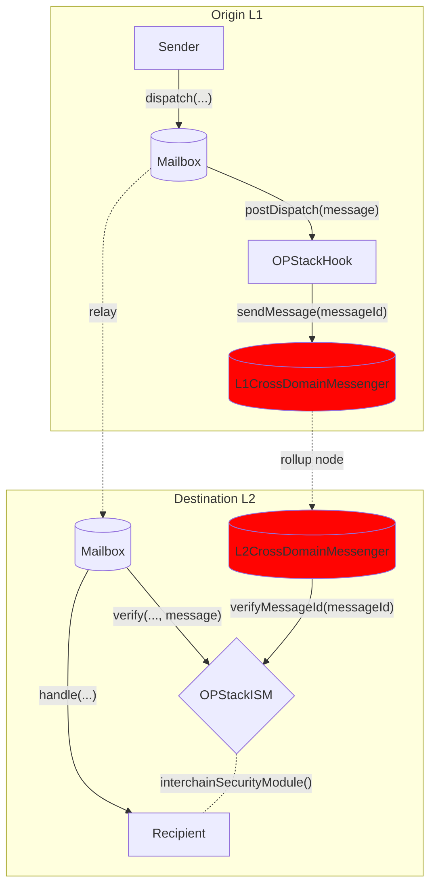

# OP Stack Hook

Optimism 和其他 [OP Stack](https://stack.optimism.io/) rollup 具有自己的 L1 和 L2 之间的消息传递接口，称为 `CrossDomainMessenger`。通过此接口传递的消息受益于 rollup [结算层](https://stack.optimism.io/docs/understand/landscape/#execution) 的安全性。

```solidity file=<rootDir>/node_modules/@hyperlane-xyz/core/contracts/interfaces/optimism/ICrossDomainMessenger.sol#L15-L19
```

为了在 Hyperlane 中提供这种安全性，我们创建了一个 Hook 和 ISM 组合，可以透明地配置以重用原生 OP Stack 接口。

请参阅 [地址](../contract-addresses.mdx) 页面以获取 Hook 和 ISM 地址。

## 工作原理

OPStackHook 将 messageId 发送到 L1CrossDomainMessenger，该 Messenger 将其注册为 Optimism 的 `TransactionDeposited` 事件，包含 ETH 存款和消息数据，这些数据会被 rollup 节点提取。rollup 节点调用预编译合约 `L2CrossDomainMessenger` 的 relayMessage 函数，进而调用配置的 OptimismISM 合约，将 messageId 设置在 verifiedMessageId 的映射中，指向原始的 L1 发送者（即用户）。中继器仅携带消息而不带元数据，等待 Optimism 节点提取并进行存储写入，消息交付随后得到验证。


