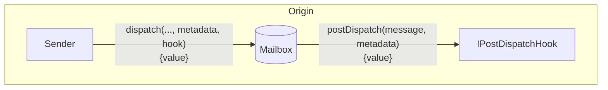
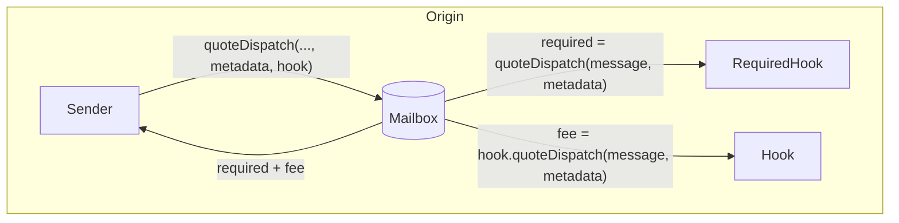
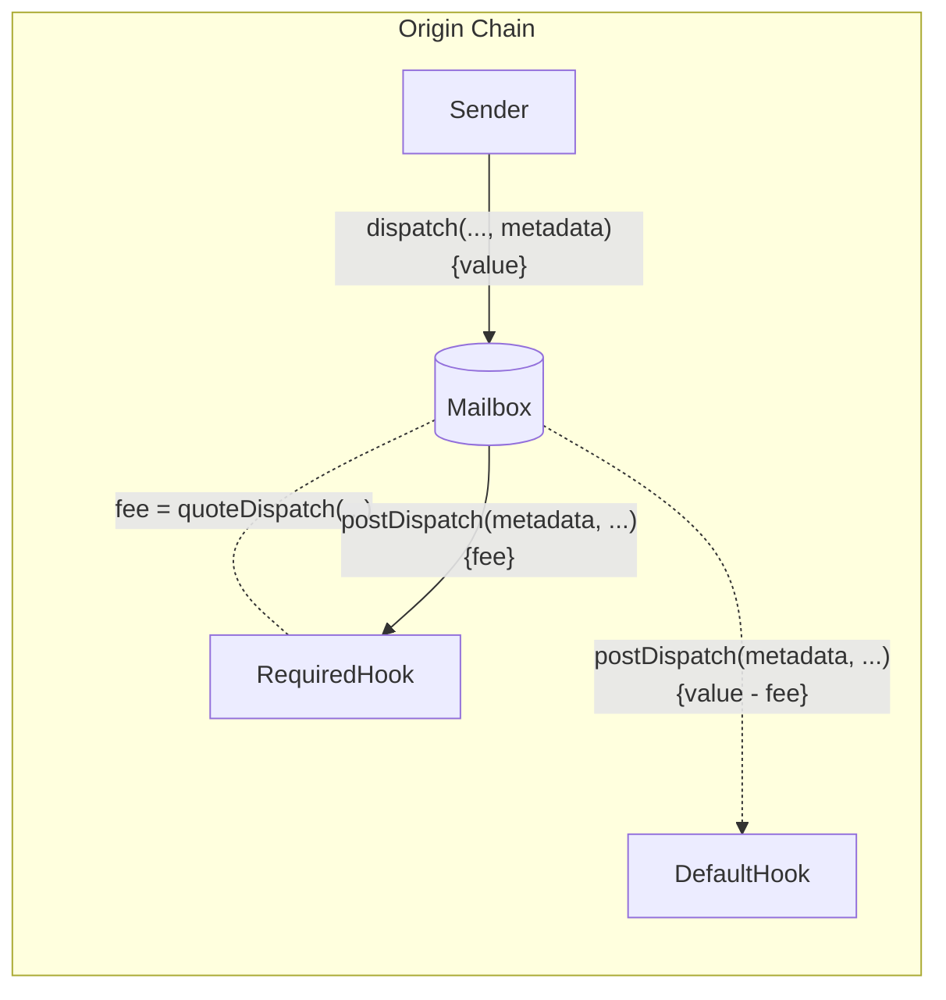

import Tabs from "@theme/Tabs";
import TabItem from "@theme/TabItem";

import { MultiLanguageExample } from "@site/src/components/InteractiveExample";

# 邮件分发 Hooks

邮件分发 Hooks 允许开发者通过邮件箱配置附加的原始链行为，使用通过邮件箱分发的消息内容。



这使得开发者能够集成第三方/本地桥接，进行额外的链承诺，或要求自定义费用，同时保持一致的单次调用邮件箱接口。

<details>
<summary>`IPostDispatchHook` 接口</summary>

<Tabs groupId="lang">
<TabItem value="sol" label="Solidity">

```solidity file=<rootDir>/node_modules/@hyperlane-xyz/core/contracts/interfaces/hooks/IPostDispatchHook.sol

```

</TabItem>
</Tabs>
</details>

## 邮件分发

除了通过邮件箱分发的 `message`，`postDispatch` 函数还接收一个 `metadata` 参数。`metadata` 参数从 `dispatch` 调用中传递，通过邮件箱未被修改。这允许开发者传递任何他们希望通过钩子传递的上下文。

<Tabs groupId="lang">
<TabItem value="sol" label="Solidity">

```solidity file=<rootDir>/node_modules/@hyperlane-xyz/core/contracts/interfaces/hooks/IPostDispatchHook.sol#L52-L55

```

</TabItem>
</Tabs>

如果 `postDispatch` 函数接收到的支付不足，可能会回滚。

:::info
后处理钩子可能是可重放的。创建自定义钩子的开发者应实现安全检查以防止这种行为。[这里](https://github.com/hyperlane-xyz/hyperlane-monorepo/blob/b69bc23239ecfc8f8a6277bb0f9bc248cffea234/solidity/contracts/hooks/warp-route/RateLimitedHook.sol#L16) 是一个示例实现。
:::

### 报价处理（费用）

费用通常在 `postDispatch` 中收取，以覆盖诸如目标链交易提交和安全提供等成本。要获取相应 `postDispatch` 调用的报价，可以查询 `quoteDispatch` 函数。

<Tabs groupId="lang">
<TabItem value="sol" label="Solidity">

```solidity file=<rootDir>/node_modules/@hyperlane-xyz/core/contracts/interfaces/hooks/IPostDispatchHook.sol#L63-L66

```

</TabItem>
</Tabs>

邮件箱有一个 `quoteDispatch` 函数，返回成功执行 `dispatch` 调用所需的总费用。



转到实现钩子指南 [这里](../../guides/create-custom-hook-and-ism.mdx)

### 重写默认 hook 元数据

要重写默认元数据，有一个 `dispatch` 重载，接受一个可选的 `metadata` 参数。

:::info
Hooks 当前期望元数据使用 [`StandardHookMetadata` 库](../libraries/hookmetadata.mdx) 格式化。
:::

<Tabs groupId="lang">
<TabItem value="sol" label="Solidity">

```solidity file=<rootDir>/node_modules/@hyperlane-xyz/core/contracts/interfaces/IMailbox.sol#L71-L76

```

</TabItem>
</Tabs>

自定义的 `metadata` 将在传递给所需钩子的 `quoteDispatch` 和 `postDispatch` 函数之前，传递给默认钩子的 `postDispatch` 函数。



#### 示例

<details>
<summary>`StandardHookMetadata` 库</summary>

<Tabs groupId="lang">
<TabItem value="sol" label="Solidity">

```solidity file=<rootDir>/node_modules/@hyperlane-xyz/core/contracts/hooks/libs/StandardHookMetadata.sol

```

</TabItem>
</Tabs>
</details>

<MultiLanguageExample
  solidity={({
    mailbox,
    originChain,
    destinationDomain,
    destinationChain,
    paddedRecipient,
    body,
  }) => `\
// 从 ${originChain} 发送消息到 ${destinationChain} 测试接收者
IMailbox mailbox = IMailbox("${mailbox}");
mailbox.dispatch{value: msg.value}(
  ${destinationDomain},
  "${paddedRecipient}",
  bytes("${body}"),
  StandardHookMetadata.overrideGasLimit(200000)
);
`}
/>

### 自定义钩子和元数据

在实现上述接口后，您可以通过在邮件箱中使用重载的 `dispatch` 调用来重写默认钩子及其元数据：

<Tabs groupId="lang">
<TabItem value="sol" label="Solidity">

```solidity file=<rootDir>/node_modules/@hyperlane-xyz/core/contracts/interfaces/IMailbox.sol#L85-L91

```

### 示例

<MultiLanguageExample
  solidity={({
    mailbox,
    merkleTreeHook,
    originChain,
    destinationDomain,
    destinationChain,
    paddedRecipient,
    body,
  }) => `\
// 从 ${originChain} 发送消息到 ${destinationChain} 测试接收者
IMailbox mailbox = IMailbox("${mailbox}");
IPostDispatchHook merkleTree = IPostDispatchHook("${merkleTreeHook}");
mailbox.dispatch(
  ${destinationDomain},
  "${paddedRecipient}",
  bytes("${body}"),
  "0x", // 空元数据
  merkleTree
);
`}
/>

</TabItem>
</Tabs>
