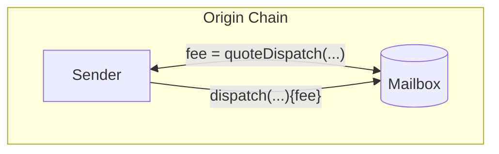
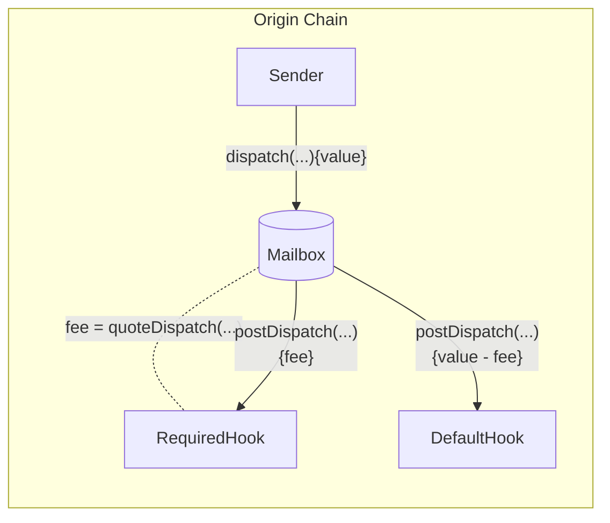

import Tabs from "@theme/Tabs";
import TabItem from "@theme/TabItem";

import { MultiLanguageExample } from "@site/src/components/InteractiveExample";

import SimpleMessagingDiagram from "@site/src/diagrams/messaging-simple.md";

# 发送消息

开发者通过调用 `Mailbox.dispatch()` 来发送跨链消息。

该函数接收消息内容、目标链 ID 和接收者地址作为参数。每条消息都会作为叶子节点插入到 `Mailbox` 存储的[增量默克尔树](https://medium.com/@josephdelong/ethereum-2-0-deposit-merkle-tree-13ec8404ca4f)中。Hyperlane 的权益证明协议使用这个默克尔树来验证欺诈证明。

<SimpleMessagingDiagram />

## Dispatch

调用此函数可将消息发送到目标域和接收者。

:::warning
Hyperlane 只能向实现了 `handle` 函数的智能合约投递消息。查看[接收消息](./receive.mdx)文档获取更多信息。
:::

根据[post-`dispatch` 钩子配置](##post-dispatch-hook-config),可能需要支付一些费用。查看 [`quoteDispatch`](#quote-dispatch) 部分获取更多信息。

<Tabs groupId="lang">
<TabItem value="sol" label="Solidity">

```solidity file=<rootDir>/node_modules/@hyperlane-xyz/core/contracts/interfaces/IMailbox.sol#L59-L63

```

:::info
为了兼容不同寻址方式的虚拟机,接收者地址会左填充至 `bytes32`。[`TypeCasts` 库](../libraries/typecasts.mdx)提供了以下实用工具:

```solidity file=<rootDir>/node_modules/@hyperlane-xyz/core/contracts/libs/TypeCasts.sol#L5-L8

```

:::

</TabItem>

</Tabs>

### 示例

<MultiLanguageExample
  solidity={({
    mailbox,
    originChain,
    destinationDomain,
    destinationChain,
    paddedRecipient,
    body,
  }) => `\
// 从 ${originChain} 发送消息到 ${destinationChain} 的 TestRecipient
IMailbox mailbox = IMailbox("${mailbox}");
bytes32 messageId = mailbox.dispatch{value: msg.value}(
  ${destinationDomain},
  "${paddedRecipient}",
  bytes(\"${body}\")
);`}
/>

## 查询发送费用

通常会配置费用来支付 IGP 支付以及协议成本。这包括目标链上的交易提交、安全保障和维护费用。你可以通过调用 `quoteDispatch` 函数来获取相应 `dispatch` 调用的费用报价。



<Tabs groupId="lang">
<TabItem value="sol" label="Solidity">

```solidity file=<rootDir>/node_modules/@hyperlane-xyz/core/contracts/interfaces/IMailbox.sol#L65-L69

```

必须将报价的 `fee` 作为 value 传递给 `dispatch` 调用以确保它不会回滚。

</TabItem>

</Tabs>

### 示例

<MultiLanguageExample
  solidity={({
    mailbox,
    originChain,
    destinationDomain,
    destinationChain,
    paddedRecipient,
    body,
  }) => `\
// 查询从 ${originChain} 发送消息到 ${destinationChain} TestRecipient 的费用
IMailbox mailbox = IMailbox("${mailbox}");
uint32 destination = ${destinationDomain};
bytes32 recipient = "${paddedRecipient}";
bytes memory body = bytes("${body}");
uint256 fee = mailbox.quoteDispatch(destination, recipient, body);
mailbox.dispatch{value: fee}(destination, recipient, body);
`}
/>

:::danger
向 `dispatch` 支付的费用不足会导致回滚。如果你组合使用多个钩子,超额支付的费用**可能不会**退还给消息发送者。
:::

## Post-Dispatch 钩子配置

Mailbox 上配置了两个钩子:

- `required`: 对所有支付了所需费用的 `dispatch` 调用都会触发
- `default`: 在 `required` 钩子之后使用剩余 value 触发(除非被覆盖)



### Required 钩子

你可以调用 `requiredHook` 函数查询 required 钩子配置。

<Tabs groupId="lang">
<TabItem value="sol" label="Solidity">

```solidity file=<rootDir>/node_modules/@hyperlane-xyz/core/contracts/interfaces/IMailbox.sol#L55

```

</TabItem>
</Tabs>

### Default 钩子

你可以调用 `defaultHook` 函数查询 default 钩子配置。

<Tabs groupId="lang">
<TabItem value="sol" label="Solidity">

```solidity file=<rootDir>/node_modules/@hyperlane-xyz/core/contracts/interfaces/IMailbox.sol#L53

```

</TabItem>
</Tabs>

要在 `dispatch` 调用中用自定义钩子覆盖默认钩子,请参阅[钩子参考](../hooks/overview.mdx)。
